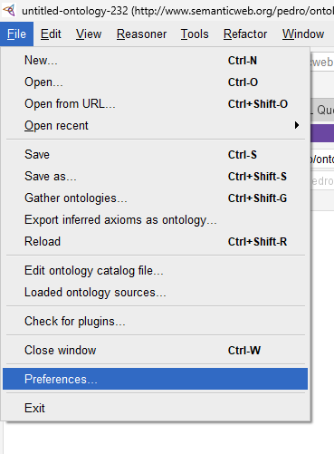
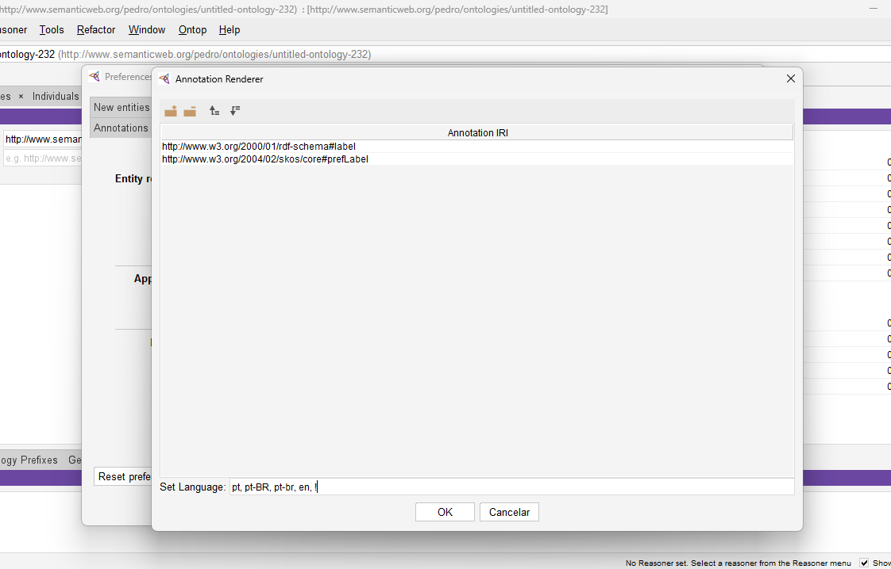
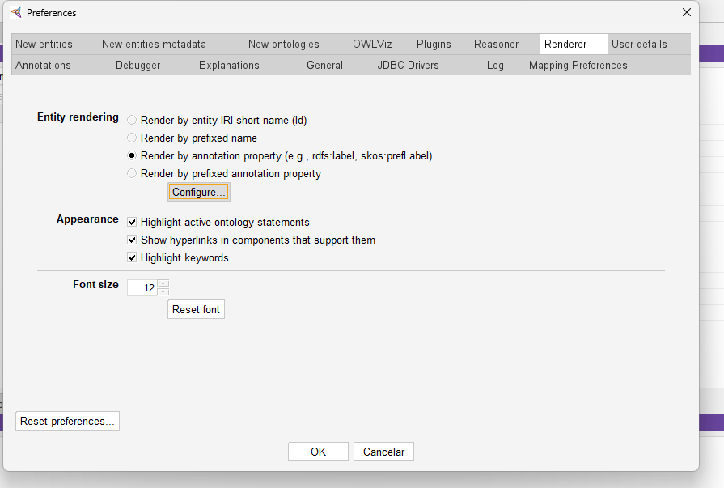

# ONTAE

## Configuration & Usage Guide

### Rendering Rules in the System

- Each class must be associated with at least one data property with an explicit `rdfs:range` so it can be correctly rendered in the visualization system. If this connection is missing, the class will be ignored at render time.
- Ensure that the data properties used for rendering are linked to the class through `owl:Restriction` axioms or equivalent logical axioms.
- Whenever possible, define `rdfs:domain` and `rdfs:range` for both object properties and data properties to preserve the expected behavior in the system.

### Multilingual Annotation Best Practices

- Always provide `rdfs:label` values in both Portuguese (`pt-BR` or `pt`) **and** English (`en`) for:
  - classes
  - object properties
  - data properties
  - individuals
- Any textual content defined in Portuguese (e.g. `rdfs:comment`, definitions, descriptions, general documentation) should also have an English version whenever applicable.
- Keep URIs stable and concise (e.g. numeric or short identifiers), and use labels for human-readable names instead of embedding natural language directly in the URI.

### Recommended Protégé Configuration

1. Open Protégé and go to **File → Preferences…** to configure the rendering language.

     
   _Example: File menu highlighting the "Preferences" option._

2. In the **Preferences** window, open the **Renderer** tab and click **Configure…** to select the languages used by the Annotation Renderer (e.g. `pt-BR`, `pt`, `en`).

     
   _Example: Annotation Renderer window showing selected languages `pt-BR`, `pt`, `en`._

3. Still under the **Renderer** tab, keep **Render by annotation property (e.g., rdfs:label, skos:prefLabel)** enabled so that URIs remain as codes while localized labels are displayed.

     
   _Example: Renderer configuration using annotation properties such as `rdfs:label`._

### Pre-Export Checklist

- [ ] All essential classes are associated with at least one data property with a declared `rdfs:range`.
- [ ] All relevant entities (classes, properties, individuals) have labels in both Portuguese and English.
- [ ] A reasoner has been executed in Protégé to check for inconsistencies after the latest changes.
- [ ] Version IRI and metadata have been updated, if applicable.

Following these guidelines helps keep the ONTAE ontology consistent, multilingual, and ready for integration with ontology-driven visualization systems.

---

## How to Add Images to this README

1. Place your screenshots inside the repository, for example:

   - `docs/images/protege-file-preferences.png`
   - `docs/images/protege-annotation-renderer-languages.png`
   - `docs/images/protege-renderer-settings.png`

2. Reference them in the README using Markdown:

   ```md
   
